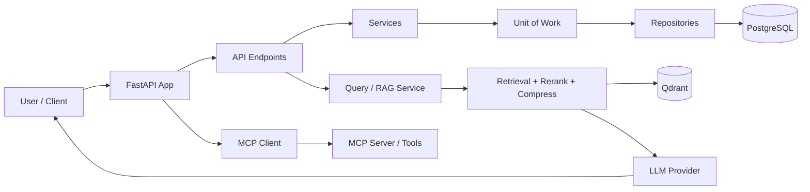
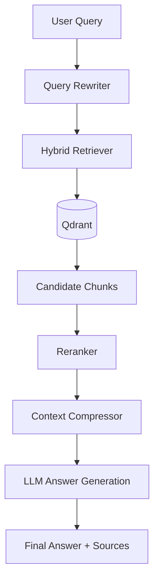

# AIOS

AIOS is a multi-tenant, AI-powered backend for organization-based knowledge work. It combines FastAPI, SQLAlchemy, JWT auth, vector search, and AI retrieval workflows to support secure organization management and AI-assisted document querying.

The system is designed for a SaaS-style architecture where each user belongs to an organization, each organization manages its own data, and AI features operate on that organization’s knowledge base.

## What AIOS does

AIOS includes:

- organization and user management
- JWT-based authentication and role-aware access
- async PostgreSQL persistence with SQLAlchemy
- knowledge-base and document ingestion workflows
- AI question answering over indexed organizational content
- agent-style tool use via MCP integration
- health checks, structured API responses, and OpenAPI docs
- database migration support with Alembic

This is more than a basic CRUD starter. It is built around a practical enterprise AI assistant pattern: users work inside an organization, upload or index documents, and ask questions that are answered using retrieved context from those documents.

## Architecture overview

AIOS follows a layered backend design:

- API layer: FastAPI routers and endpoints
- Service layer: business logic for auth, organization, chat, query, document processing
- Repository / UoW layer: database access and transaction boundaries
- Data layer: PostgreSQL via SQLAlchemy async ORM
- AI layer: document processing, vector retrieval, reranking, and LLM integration
- External services: Redis, Qdrant, MCP server, and LLM providers

### System flow



## Main project structure

```text
AIOS/
├── app/
│   ├── api/v1/
│   │   ├── endpoints/
│   │   └── router.py
│   ├── core/
│   ├── db/
│   ├── models/
│   ├── repositories/
│   ├── services/
│   ├── schemas/
│   ├── dependencies/
│   ├── exceptions/
│   ├── llm/
│   ├── document_processing/
│   ├── mcp/
│   ├── storage/
│   ├── tools/
│   ├── cache/
│   └── main.py
├── alembic/
├── .env
├── .env.example
├── docker-compose.yml
├── Dockerfile
├── pyproject.toml
├── README.md
├── uv.lock
├── docs/
│   └── aios.md
└── .venv/

```

## Core technologies

- Python 3.11
- FastAPI
- SQLAlchemy 2.x with asyncpg
- PostgreSQL
- Redis
- Qdrant
- Alembic
- Pydantic + Pydantic Settings
- Pytest
- Groq / Ollama / MCP integrations for AI workflows

## Typical workflow

### 1) Authentication flow

Users register and log in with JWT tokens. Each authenticated request includes a current user, and organization-scoped resources are associated with the user’s organization.

### 2) Knowledge-base flow

Documents are ingested, parsed, chunked, embedded, and stored in vector storage for semantic retrieval.

### 3) AI query flow

When a user asks a question:

1. the query is rewritten for better retrieval
2. hybrid search retrieves relevant chunks
3. reranking selects the best candidates
4. context is compressed
5. the LLM answers using that context
6. sources are returned with the response



### 4) Agentic tool flow

The app can start an MCP client and connect to an MCP server. The LLM may invoke available tools, and the backend handles tool execution and injects results back into the conversation loop.

## Environment setup

### Prerequisites

- Python 3.11+
- PostgreSQL
- Redis
- Qdrant
- Docker + Docker Compose (optional but recommended)

### Create and activate a virtual environment

On Windows (Git Bash / PowerShell):

```bash
python -m venv .venv
source .venv/Scripts/activate
```

On Linux/macOS:

```bash
python3 -m venv .venv
source .venv/bin/activate
```

### Install dependencies

```bash
uv sync
```

### Configure environment

Copy the example environment file and set the required values:

```bash
cp .env.example .env
```

Then update `.env` with the needed database, JWT, Redis, LLM, and vector settings.

## Run the app

### With Docker

```bash
docker compose up --build
```

Then open:

- http://localhost:8000/docs
- http://localhost:8000/redoc

### Without Docker

```bash
alembic upgrade head
uvicorn app.main:app --reload
```

The app will be available at:

- http://127.0.0.1:8000/docs

## API overview

The app is exposed under the `/api/v1` router.

### Health

- `GET /api/v1/health/health`

### Auth

- `POST /api/v1/auth/register`
- `POST /api/v1/auth/login`
- `POST /api/v1/auth/refresh`
- `POST /api/v1/auth/logout`
- `GET /api/v1/auth/me`

### Organizations

- `POST /api/v1/organizations`
- `GET /api/v1/organizations`
- `GET /api/v1/organizations/{organization_id}`
- `PATCH /api/v1/organizations/{organization_id}`
- `DELETE /api/v1/organizations/{organization_id}`

### Query / AI

- `POST /api/v1/query`

## Example requests

### Register a user

```bash
curl -X POST http://localhost:8000/api/v1/auth/register \
  -H "Content-Type: application/json" \
  -d '{
    "organization_id": "3fa85f64-5717-4562-b3fc-2c963f66afa6",
    "full_name": "John Doe",
    "email": "john@example.com",
    "password": "strongpassword"
  }'
```

### Login

```bash
curl -X POST http://localhost:8000/api/v1/auth/login \
  -H "Content-Type: application/json" \
  -d '{
    "email": "john@example.com",
    "password": "strongpassword"
  }'
```

## Database migrations

```bash
alembic revision --autogenerate -m "describe migration"
alembic upgrade head
```

## Testing

```bash
pytest -q
```

## Documentation

Detailed project documentation is available here:

- [aios/docs/aios.md](aios/docs/aios.md)

## Summary

AIOS is a FastAPI-based, multi-tenant AI backend that combines secure organization management, document knowledge bases, and retrieval-driven AI assistant workflows. It is designed to serve as a practical foundation for enterprise-style AI products and internal knowledge systems.

