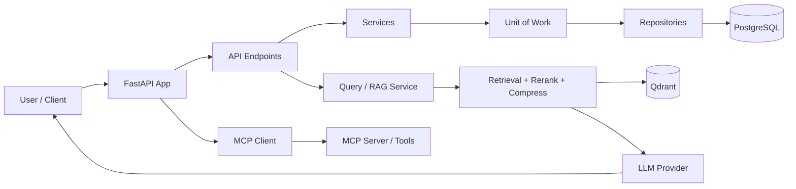
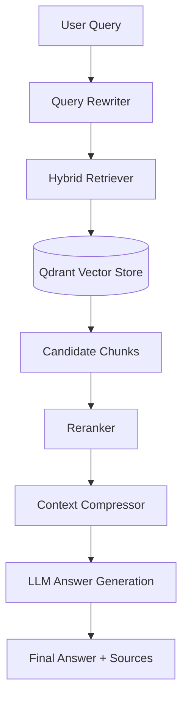
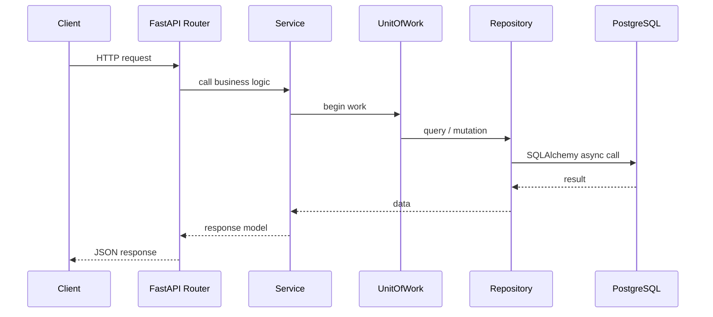
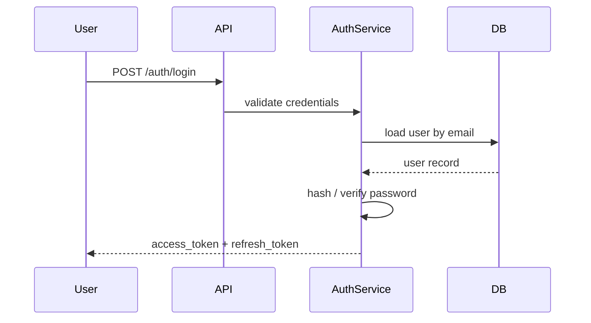
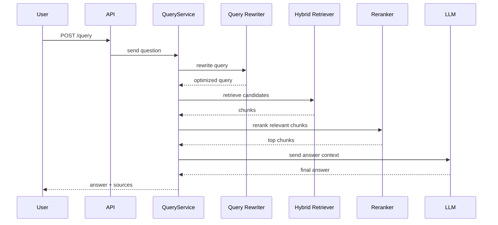

# AIOS Project Documentation

## 1. What this project is about

AIOS is a multi-tenant, AI-enabled backend system built with FastAPI. Its purpose is to provide a foundation for organizations that need:

- user and role-based access management
- organization-level data isolation
- AI-assisted chat and retrieval over organizational knowledge
- document ingestion and knowledge-base indexing
- agent-driven workflows using Model Context Protocol (MCP) tools
- a clean, modular backend architecture ready for extension

At a high level, AIOS is not just an authentication app. It is a backend for building an internal AI workspace where users belong to an organization, can create agents/conversations, upload documents, and ask questions over indexed knowledge.

---

## 2. Core business idea

The product combines classic SaaS patterns with modern AI retrieval patterns:

- Multi-tenant structure: each user belongs to an organization.
- Secure access: authentication and authorization enforce organization boundaries.
- Knowledge system: documents are processed, chunked, embedded, and stored for retrieval.
- AI assistant layer: questions are rewritten, searched, reranked, and answered using context from organizational data.
- Tool integration: the app can call external MCP tools and expose them to the LLM as function tools.

This gives the system a practical “enterprise AI assistant” shape rather than a pure toy API.

---

## 3. High-level architecture

The project follows a layered architecture:

1. API layer
   - FastAPI routers and endpoints
2. Service layer
   - business logic for auth, organizations, chat, query, documents
3. Unit-of-work / repository layer
   - database operations and transaction boundaries
4. Data layer
   - PostgreSQL via SQLAlchemy Async ORM
5. AI/knowledge layer
   - document parsers, chunkers, embedders, retrievers, rerankers, LLM providers
6. External services
   - Redis, Qdrant, LLM providers (Groq, Ollama), MCP server

### Main application flow



---

## 4. Project structure

The repository is organized around feature domains and infrastructure:

```text
AIOS/
├── app/
│   ├── api/v1/
│   │   ├── endpoints/
│   │   └── router.py
│   ├── core/
│   │   ├── config.py
│   │   ├── security.py
│   │   ├── jwt.py
│   │   └── logging.py
│   ├── db/
│   ├── models/
│   ├── repositories/
│   ├── services/
│   ├── schemas/
│   ├── dependencies/
│   ├── exceptions/
│   ├── llm/
│   ├── document_processing/
│   ├── mcp/
│   ├── storage/
│   ├── tools/
│   ├── cache/
│   └── main.py
├── alembic/
├── .env
├── docker-compose.yml
├── Dockerfile
├── pyproject.toml
├── README.md
└── aios/
    └── docs/
        └── aios.md
```

### Key directories

- app/api/v1: API route registration and endpoint handlers
- app/services: business logic for auth, organizations, conversations, documents, queries
- app/models: SQLAlchemy models for users, organizations, conversations, documents, agents, etc.
- app/repositories: data access layer built over async SQLAlchemy
- app/core: settings, JWT, security utilities, logging
- app/document_processing: chunking, parsing, embedding, retrieval, reranking, and RAG pipeline
- app/mcp: MCP client/server integration for tool orchestration
- app/llm: LLM provider abstractions and provider factory
- alembic: database migration scripts

---

## 5. Main components and responsibilities

### 5.1 API layer

The app exposes a versioned API under `/api/v1` through `app/api/v1/router.py`.

Included routers cover:

- health
- auth
- organizations
- agents
- conversations
- messages
- knowledge bases
- documents
- query

This keeps routes grouped by domain and makes the backend easier to extend.

### 5.2 Authentication and authorization

The system is built around organization membership and JWT tokens.

From the config and auth service patterns:

- JWT is configured with a secret key and algorithm
- access and refresh tokens are used for login flow
- refresh tokens are stored/managed through Redis or a session store
- requests use dependency injection to load the current user
- organization-bound resources are associated with a user’s organization ID

This is essential in a multi-tenant architecture because data must not bleed across organizations.

### 5.3 Data model

The main relational model includes:

- Organization
- User
- Agent
- Conversation
- Message
- KnowledgeBase
- Document

The `Organization` model owns many tenants of the platform, and `User` references an organization via `organization_id`. This keeps every resource tied to an organization and makes filtering straightforward.

### 5.4 AI and retrieval pipeline

The strongest differentiator in this project is the AI document-retrieval layer.

The `QueryService` does the following:

1. takes a user query
2. rewrites it for better retrieval
3. performs hybrid retrieval from vector storage
4. reranks candidate chunks
5. compresses the context
6. returns the final contextual answer sources



This is a classic RAG architecture with query improvement, retrieval, semantic ranking, and answer synthesis.

### 5.5 MCP tool integration

The project also integrates with MCP (Model Context Protocol), which allows the LLM to call external tools.

The flow is:

- the app starts an MCP client at startup
- the client connects to an MCP server
- tools are listed and exposed to the model
- when the model decides it needs tool execution, the backend calls the tool and injects the result into the conversation loop

This is important for agentic workflows where the model can perform actions instead of only answering from static text.

### 5.6 Document processing lifecycle

The project includes a document processing pipeline for knowledge ingestion:

- parse files
- split into chunks
- generate embeddings
- store them in vector storage
- later retrieve them using queries

This is the foundation of the knowledge base and retrieval functionality.

---

## 6. Runtime workflow

### Request lifecycle

A typical request enters through FastAPI and flows through the following steps:



### Authentication workflow



### AI query workflow



---

## 7. How the project is built

The app is organized around a few core design decisions:

### 7.1 Async-first backend

The project uses async SQLAlchemy and async FastAPI patterns. This allows the API to handle many concurrent requests without blocking on database I/O.

### 7.2 Multi-tenancy

Every major resource is associated with an organization. This makes the backend suitable for SaaS-style environments where different teams use the same system but should not see each other’s data.

### 7.3 Layered service design

The typical pattern is:

- endpoint -> service -> repository/unit-of-work -> database

This keeps logic clean and preserves separation of concerns.

### 7.4 AI-first knowledge architecture

Unlike simple CRUD systems, this project includes model-based retrieval orchestration, tool-calling, and document indexing. AI is core to the backend’s purpose, not a plugin.

---

## 8. External systems used

### PostgreSQL

Stores application data: users, organizations, conversations, messages, knowledge bases, documents, and metadata.

### Redis

Used for refresh/session or cache-oriented patterns in auth or transient state.

### Qdrant

Stores vector embeddings and enables semantic retrieval over organizational documents.

### LLM providers

The code is configured to use providers like Groq and Ollama for generation and query rewriting.

### MCP server

Exposes tool capabilities for the agent and LLM runtime to call functions in structured ways.

---

## 9. Typical user journey

A normal end-to-end user flow looks like this:

1. User signs up under an organization.
2. User logs in and receives JWT tokens.
3. User uploads or indexes documents into a knowledge base.
4. The document pipeline splits and embeds content.
5. User asks a question through the query API.
6. The system retrieves relevant chunks from vector search.
7. The LLM synthesizes an answer grounded in those chunks.
8. The answer and source passages are returned to the user.

This is the central product loop of AIOS.

---

## 10. Development and operations workflow

### Local development

The project is designed to run with:

- Python 3.11+
- FastAPI
- SQLAlchemy
- PostgreSQL
- Redis
- Qdrant
- Docker Compose for container orchestration

Typical local flow:

1. create and activate the virtual environment
2. install dependencies
3. set `.env` values
4. run database migrations with Alembic
5. start the app with uvicorn or Docker Compose
6. use `/docs` for Swagger UI

### Common commands

```bash
source .venv/Scripts/activate
uv sync
alembic upgrade head
uvicorn app.main:app --reload
```

The app is also expected to be run through Docker Compose in many deployments.

---

## 11. Why this project matters

AIOS is a practical, modern backend for an AI workspace. It combines three essential patterns:

- enterprise SaaS access control
- retrieval-based AI knowledge systems
- agent/tool capability via MCP

In other words, it is a real-world architecture for building AI-powered business software rather than only a demo app.

---

## 12. Summary

AIOS is a FastAPI-based, multi-tenant AI backend for organizations that need secure user management plus knowledge-aware AI interactions. The system uses a layered architecture, SQLAlchemy for persistence, vector search for retrieval, LLM providers for answers, and MCP tools for agentic actions. The result is a platform capable of supporting conversations, documents, agents, and knowledge-base-driven workflows.
